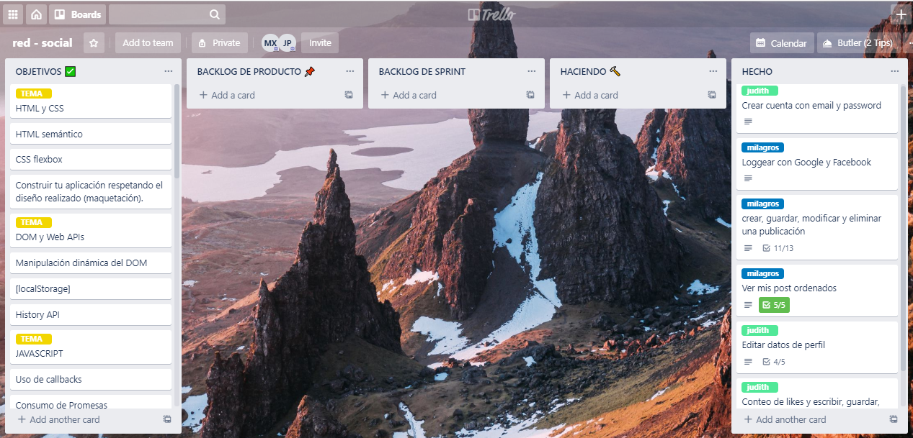

# "Vida Sana"

Vida Sana es una red social dirigida para personas personal del todo el mundo, que deseen compartir tips, recetas y rutinas para llevar una vida saludable, al mismo tiempo crear una comunidad con los mismos objetivos de tener o empezar con mejores hábitos alimenticios y deportivos. 

## Prototipos de alta 

### Desktop

### Mobile

Para el desarrollo de este proyecto nos hemos organizado con la Creación de 6 historias de usuario, usamos como base de Datos a Firebase junto con javaScript, HTML y css3 para asi poder ir desarrollando cada historia de usuario.

Esto nos permitio usar algunos servicios de firebase como el inicio de sesion con facebbok y google, y la opcion de crear su propio usuario. 
Una vez que el usuario este logueado tiene la opcion de visualizar su perfil y editar su descripcion, también podra crear un post con texto e imagen, para luego poderlo modificarlo y eliminarlo, a su vez tambien crear un comentario en cada post con las mismas opciones de editar, modificar y eliminar, para implementar estas funciones utilizamos Firestore y el Cloud Storage.
Además tiene la posibilidad de configurar la privacidad de cada post de manera públicoa o privada, de tal manera que solo el usuario pueda visualizas sus propios post cuando estan configurados como privados. 

Para complementar tenemos un contador de likes donde puedes dar o quitar un like a cada post y un contador de comentarios.

## Historias de Usuario

* Como usuario nuevo debo poder crear una cuenta con email y password válidos para poder iniciar sesion e ingresar a la red social.

* Como usuario nuevo debo poder tener la opción de iniciar sesión con mi cuenta de Google o Facebook para ingresar a la red social sin necesidad de crear una cuenta de email válido.

* Como usuario loggeado debo poder crear, guardar, modificar en el mismo lugar (in place) y eliminar una publicación (post) privada o pública, que puede ser una frase o una imagen.

* Como usuario loggeado debo poder ver todos los posts públicos y privados que he creado hasta ese momento, desde el más reciente hasta el más antiguo, así como la opción de poder cambiar la configuración de privacidad de mis post.

* Yo como usuario loggeado, puedo dar like y llevar un conteo de likes en mi publicación así como poder escribir, guardar, editar o eliminar un comentario en mi publicación.

* Al final debo poder ingresar a la red social y poder visualizar los datos de mi perfil creado o editarlos.

### Organización de las hisotrias de usuario

## Objetivos de aprendizaje

### HTML y CSS

* [X] [HTML semántico](https://developer.mozilla.org/en-US/docs/Glossary/Semantics#Semantics_in_HTML)
* [X] [CSS `flexbox`](https://css-tricks.com/snippets/css/a-guide-to-flexbox/)
* [X] Construir tu aplicación respetando el diseño realizado (maquetación).

### DOM y Web APIs

* [X] [Manipulación dinámica del DOM](https://developer.mozilla.org/es/docs/Referencia_DOM_de_Gecko/Introducci%C3%B3n)
* [ ] [History API](https://developer.mozilla.org/es/docs/DOM/Manipulando_el_historial_del_navegador)
* [X] [`localStorage`]

### Javascript

* [X] [Uso de callbacks](https://developer.mozilla.org/es/docs/Glossary/Callback_function)
* [X] [Consumo de Promesas](https://scotch.io/tutorials/javascript-promises-for-dummies#toc-consuming-promises)
* [X] Uso ES modules
([`import`](https://developer.mozilla.org/en-US/docs/Web/JavaScript/Reference/Statements/import)
| [`export`](https://developer.mozilla.org/en-US/docs/Web/JavaScript/Reference/Statements/export))

### Firebase

* [X] [Firestore](https://firebase.google.com/docs/firestore)
* [X] [Firebase Auth](https://firebase.google.com/docs/auth/web/start)
* [ ] [Firebase security rules](https://firebase.google.com/docs/rules)
* [X] [Uso de onSnapshot](https://firebase.google.com/docs/firestore/query-data/listen)
| [onAuthStateChanged](https://firebase.google.com/docs/auth/web/start#set_an_authentication_state_observer_and_get_user_data)

### Testing

* [X] [Testeo de tus funciones](https://jestjs.io/docs/es-ES/getting-started)
* [X] [Testeo asíncrono](https://jestjs.io/docs/es-ES/asynchronous)
* [X] [Mocking](https://jestjs.io/docs/es-ES/manual-mocks)

### Colaboración en Github

* [X] Branches
* [X] Pull Requests
* [ ] Tags

### Organización en Github

* [X] Projects
* [X] Issues
* [X] Labels
* [ ] Milestones

### Buenas prácticas de desarrollo

* [X] Modularización
* [X] Nomenclatura / Semántica
* [ ] Linting

***

## Recursos

### Mobile first 
[_mobile first_](https://www.mediaclick.es/blog/diseno-web-responsive-design-y-la-importancia-del-mobile-first/)

### Escritura de datos
[Firestore](https://firebase.google.com/docs/firestore)`localStorage`.

### Autenticación y autorización
Para esto utilizaras respectivamente
[`Firebase authentication`](https://firebase.google.com/docs/auth/) y
[`Firestore security rules`](https://firebase.google.com/docs/firestore/security/get-started)

### CSS
[`flexbox`](https://css-tricks.com/snippets/css/a-guide-to-flexbox/)
[*sass*](https://sass-lang.com/).

### Otras:

* [Pildora SPA](https://www.loom.com/share/fa63a8ad0e9a43428222c15b6f6613d3)
* [Repositorio de pildora de SPA](https://github.com/betsyvies/bootcamp-spa)
* [Pildora de mock Firebase](https://www.youtube.com/watch?v=06myVn41OTY&t=1s)
* [Repositorio de pildora de mock Firebase](https://github.com/Danielalab/2018-2-Testing)
* [Pildora MVC](https://github.com/merunga/todomvc-vanillajs)
* [Modulos: Export](https://developer.mozilla.org/es/docs/Web/JavaScript/Referencia/Sentencias/export)
* [Modulos: Import](https://developer.mozilla.org/es/docs/Web/JavaScript/Referencia/Sentencias/import)
* [Diseño web, responsive design y la importancia del mobile first - Media Click](https://www.mediaclick.es/blog/diseno-web-responsive-design-y-la-importancia-del-mobile-first/)
* [Mobile First: el enfoque actual del diseño web móvil - 1and1](https://www.1and1.es/digitalguide/paginas-web/diseno-web/mobile-first-la-nueva-tendencia-del-diseno-web/)
* [Mobile First - desarrolloweb.com](https://desarrolloweb.com/articulos/mobile-first-responsive.html)
* [Mobile First - ZURB](https://zurb.com/word/mobile-first)
* [Mobile First Is NOT Mobile Only - Nielsen Norman Group](https://www.nngroup.com/articles/mobile-first-not-mobile-only/)

***
